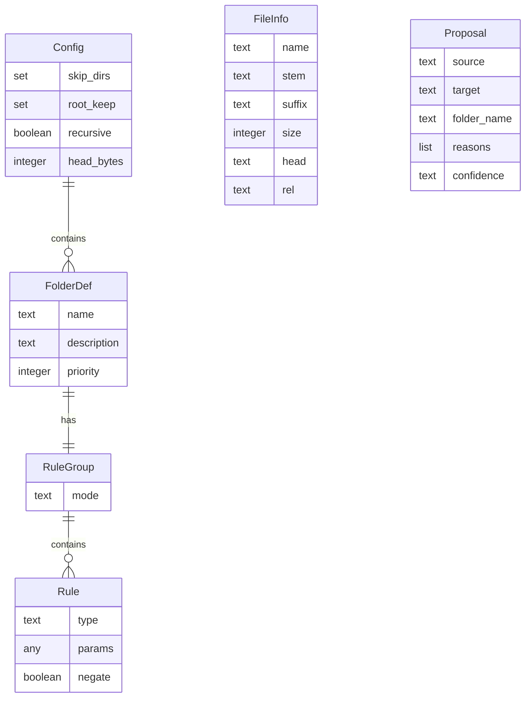

# Declarative File Organization

> Classify and relocate files within a directory using externally defined rules, without embedding domain knowledge in the organizer itself.

## Disclaimer

This work is subject to the methodological caveats and commitments described in [@DISCLAIMER.md](../DISCLAIMER.md).
> No statement or premise not backed by a real logical definition or verifiable reference should be taken for granted.

## Status

| Field | Value |
|-------|-------|
| Version | 1.0.0 |
| Extracted from | `tools/organize.py`, `lib/rules.py`, `lib/file_info.py`, `session-02/session02_organize.yaml` |
| Date | 2026-03-28 |
| Maturity | stable |

## Problem

Project directories accumulate files that were created at different times, by different tools, for different purposes. Without active maintenance they become flat mixtures — schemas next to prompts next to reports next to research artifacts. Manual sorting is tedious and inconsistent: two people will disagree on where a file belongs, and the rationale for each decision is lost the moment the file is moved.

The challenge is not writing a script that moves files. The challenge is separating the **policy** (which files go where, and why) from the **mechanism** (scanning, matching, moving) so that the policy can be reviewed, versioned, shared, and reused without touching any code.

## Core Idea

An organizer is split into two independent parts:

1. **A rule configuration** — a structured document that defines target folders and the classification criteria for each. The configuration is pure data: no executable logic, no callbacks, no scripts. It can be read by a human, diffed in version control, and validated by a schema.

2. **A rule engine** — a generic processor that reads the configuration, scans a directory, evaluates each file against every folder's rules, and produces a list of proposed moves. The engine has no built-in knowledge of any file type, naming convention, or domain. All classification intelligence lives in the configuration.

The engine always operates in two stages: **propose** (inspect + classify → a list of proposals), then optionally **apply** (execute the moves). The propose stage is side-effect-free — it can be run repeatedly for review without changing anything on disk.

```
┌─────────────┐     ┌──────────────┐     ┌────────────┐
│ Rule Config  │────▶│  Rule Engine  │────▶│  Proposals │──▶ [optional] Apply
│ (YAML/JSON)  │     │  (generic)    │     │  (report)  │
└─────────────┘     └──────┬───────┘     └────────────┘
                           │
                    ┌──────▼───────┐
                    │  Directory   │
                    │  (files)     │
                    └──────────────┘
```

## Domain Vocabulary

| Term | Definition |
|------|-----------|
| **Folder definition** | A named target subfolder with a description, a priority, and a rule group. |
| **Rule** | An atomic, typed predicate that tests one property of a file. Has a type name, parameters, and an optional negation flag. |
| **Rule group** | An ordered set of rules combined with a logical mode: "any" (OR) or "all" (AND). |
| **Rule type** | A named category of predicate (e.g., "extension", "content_contains"). The engine maintains a registry of available types. |
| **File info** | A pre-computed snapshot of a file's metadata: name, stem, suffix, size, head content, and relative path. Computed once per file, reused by all rules. |
| **Proposal** | A recommended move: source path, target path, matched folder name, list of matched rule explanations, and a confidence level. |
| **Confidence** | A classification of proposal certainty: "high" (single match or clear priority winner), "medium" (tie at top priority), "low" (reserved). |
| **Priority** | An integer on each folder definition. When a file matches multiple folders, the highest priority wins. Equal priorities break by definition order. |
| **Root-keep** | A set of filenames that must never be moved, regardless of rule matches. |
| **Skip-dirs** | A set of directory names to exclude from scanning entirely. |
| **Head** | The first N bytes of a file's content, read as text. Only populated for files with recognized text-like extensions; binary files yield an empty head. |

## Data Model



### Config

| Field | Type | Required | Default | Description |
|-------|------|----------|---------|-------------|
| folders | list of FolderDef | yes | — | Ordered list of target folder definitions |
| skip_dirs | set of text | no | empty | Directory names to exclude from scanning |
| root_keep | set of text | no | empty | Filenames that must stay at root |
| recursive | boolean | no | false | Whether to scan subdirectories |
| head_bytes | integer | no | 1024 | Bytes of file content to read for content rules |

### FolderDef

| Field | Type | Required | Default | Description |
|-------|------|----------|---------|-------------|
| name | text | yes | — | Target subfolder path (may contain path separators) |
| description | text | no | empty | Human-readable purpose of this folder |
| priority | integer | no | 0 | Conflict resolution rank (higher wins) |
| rules | RuleGroup | yes | — | Classification criteria |

### Rule

| Field | Type | Required | Default | Description |
|-------|------|----------|---------|-------------|
| type | text | yes | — | Registered rule type name |
| params | text, list of text, or integer | yes | — | Type-specific parameter(s) |
| negate | boolean | no | false | Invert the match result |

### Proposal

| Field | Type | Required | Description |
|-------|------|----------|-------------|
| source | text | yes | File path relative to scan root |
| target | text | yes | Proposed destination path relative to scan root |
| folder_name | text | yes | Name of the matched folder definition |
| reasons | list of text | yes | Human-readable explanations of which rules matched |
| confidence | text | yes | "high", "medium", or "low" |

## Processing Phases

### Phase 1: Load Configuration

**Purpose:** Parse the rule configuration into validated internal structures.
**Input:** A structured file (YAML or JSON) at a known path.
**Output:** A fully parsed Config containing folder definitions, settings, and rule groups.
**Invariants:**
- Every rule references a type name that exists in the rule type registry.
- Every rule dict contains exactly one type key (plus optional "negate").
- The config must define at least one folder with at least one rule.

### Phase 2: Scan Directory

**Purpose:** Enumerate candidate files and pre-compute their metadata.
**Input:** A root directory path and the Config settings (recursive, skip_dirs, root_keep, head_bytes).
**Output:** An ordered list of FileInfo records, one per candidate file.
**Invariants:**
- Files inside skip_dirs are excluded.
- Files named in root_keep are excluded.
- Hidden files (name starts with ".") are excluded unless in root_keep.
- Files already inside a target folder path are excluded (prevents re-moves on repeat runs).
- Content is only read for files with recognized text-like extensions.
- Each FileInfo is computed once and reused across all rule evaluations.

### Phase 3: Classify

**Purpose:** Evaluate every candidate file against every folder definition's rule group.
**Input:** The list of FileInfo records and the list of FolderDef.
**Output:** For each file, a list of (FolderDef, matched reasons) pairs — potentially empty.
**Invariants:**
- A file may match zero, one, or many folder definitions.
- Rule evaluation is deterministic: same FileInfo + same rules = same result.
- Rule groups with mode "all" require every rule to match; "any" requires at least one.
- Negated rules invert their result before contributing to the group.

### Phase 4: Resolve Conflicts

**Purpose:** Select the single best folder for each file that matched one or more definitions.
**Input:** The list of (FolderDef, reasons) matches for a single file.
**Output:** A single Proposal with a confidence level.
**Invariants:**
- The highest-priority match wins.
- Among equal priorities, definition order (position in the config) wins.
- Confidence is "high" if only one folder matched or the winner has strictly higher priority; "medium" if the top priority is tied.
- Files with zero matches produce no proposal (silently skipped).

### Phase 5: Report

**Purpose:** Present all proposals for human review.
**Input:** The list of Proposals.
**Output:** A human-readable report grouped by target folder, with per-file confidence tags and optional rule reasoning. Alternatively, a machine-readable serialization of all proposals.
**Invariants:**
- No side effects. The report is pure output.
- Proposals are grouped by target folder for readability.
- Summary counts are provided (total, high, medium, low).

### Phase 6: Apply (optional)

**Purpose:** Execute the proposed moves on disk.
**Input:** The list of Proposals and the root directory path.
**Output:** Files moved to their target locations. Count of successful moves.
**Invariants:**
- Target directories are created if they do not exist.
- If a target file already exists, the move is skipped (never overwrites).
- If a source file no longer exists, the move is skipped.
- Moves are non-destructive: no deletions, no renames, no overwrites.

## Classification Rules

The rule engine supports 10 built-in rule types. Each is a pure predicate: it receives a FileInfo and parameters, returns a boolean.

| Rule Type | Match Condition | Params |
|-----------|----------------|--------|
| extension | File suffix equals any listed extension | text or list of text |
| name_glob | Filename matches any glob pattern | text or list of text |
| name_regex | Filename matches any regex pattern | text or list of text |
| stem_contains | Stem (name without extension) contains any substring | text or list of text |
| stem_startswith | Stem starts with any prefix | text or list of text |
| content_contains | File head contains any substring | text or list of text |
| content_regex | File head matches any regex | text or list of text |
| size_gt | File size exceeds N bytes | integer |
| size_lt | File size is below N bytes | integer |
| path_contains | Relative path contains any substring | text or list of text |

**Conflict resolution:** Priority (integer, higher wins) → definition order (earlier wins).

**Composition:** Rules are grouped into a RuleGroup with mode "any" (OR) or "all" (AND). The same folder name may appear multiple times with different modes, enabling complex criteria without nesting.

## Configuration Surface

| Parameter | Type | Default | Description |
|-----------|------|---------|-------------|
| skip_dirs | list of text | empty | Directory names excluded from scanning |
| root_keep | list of text | empty | Filenames pinned to root (never moved) |
| recursive | boolean | false | Scan subdirectories (true) or top-level only (false) |
| head_bytes | integer | 1024 | Bytes of file content to read for content rules |
| folder.name | text | (required) | Target subfolder path |
| folder.description | text | empty | Human-readable folder purpose |
| folder.priority | integer | 0 | Conflict resolution rank |
| folder.mode | text | "any" | Rule combination: "any" (OR) or "all" (AND) |
| rule.negate | boolean | false | Invert the rule's match result |

## Boundary Conditions

**Out of scope:**
- File renaming — files are moved to a new directory but keep their original name
- Destructive operations — no deletes, no overwrites, no in-place modifications
- Binary content inspection — content rules only read text-like files by extension
- Undo/rollback — no built-in reversal mechanism (rely on version control)
- Nested rule groups — rules compose only via a single-level AND/OR group, not arbitrarily nested boolean trees

**Error categories:**
- **Unknown rule type:** A rule references a type name not in the registry. Fails at config parse time with a list of available types.
- **Malformed rule:** A rule dict has zero or more than one type key. Fails at parse time.
- **Missing config:** No config file found and none specified. Fails with a suggestion to generate one.
- **Unreadable file:** File cannot be stat'd or read. Size defaults to 0, head defaults to empty. Rules that depend on these fields will not match (fail-open for that dimension).

## Extension Points

1. **New rule types** — Register a new evaluator function in the rule type registry. No other code changes needed; the new type is immediately usable in any config.

2. **New output formats** — The proposal list is a plain data structure. New reporters (CSV, HTML, CI annotations) can consume it without changing the engine.

3. **Multiple folder entries** — The same folder name can appear multiple times with different modes and rule sets, enabling complex classification without nesting syntax.

4. **Config format** — The engine accepts any structured data source that produces a dictionary with `settings` and `folders` keys. YAML and JSON are built in; other formats require only a loader.

## Prior Art & Alternatives

| Approach | Trade-off vs. this concept |
|----------|--------------------------|
| Manual scripting (ad-hoc move commands) | Faster for one-off tasks; rules are implicit and unreviewable; no dry-run, no audit trail |
| IDE "organize imports" / auto-sort | Language-specific; operates on code structure, not file metadata; not configurable for arbitrary file types |
| Desktop file organizers (Hazel, Organize) | GUI-driven; rules are stored in opaque app state, not versionable config; richer triggers (watch mode, schedules) |
| Makefile / task-runner rules | Turing-complete but rules are entangled with execution; no separation of propose/apply; no confidence scoring |

The distinguishing property of this concept is that classification policy is **pure data** — no executable logic in the config — which makes it auditable, diffable, and safe to preview before applying.

## Provenance

- **Source implementation:** `tools/organize.py` (Python, 1040 lines including ESD docstring), `lib/rules.py` (168 lines), `lib/file_info.py` (71 lines), `session-02/session02_organize.yaml` (69 lines)
- **Key design decisions observed:**
  - **Config-over-code:** All classification intelligence is in the YAML config; the engine is domain-agnostic. Alternative rejected: hardcoded classifiers with per-project match functions.
  - **Propose-then-apply:** The default is dry-run; moves require an explicit flag. Alternative rejected: immediate execution on scan.
  - **Priority + definition-order tiebreak:** A simple integer priority resolves multi-folder conflicts, with deterministic fallback to config ordering. Alternative rejected: weighted scoring or ML-based confidence.
  - **Flat rule composition:** Rules compose via single-level AND/OR groups, not nested boolean trees. Complex cases use multiple folder entries with the same name. Alternative rejected: recursive boolean expressions (adds config complexity with marginal gain).
  - **Content sniffing by extension allowlist:** Only files with known text extensions are read for content rules. Alternative rejected: MIME detection or magic-byte sniffing (adds a dependency and complicates cross-platform behavior).
  - **Non-destructive moves only:** No overwrites, no deletes, no renames. Safety is a hard constraint. Alternative rejected: configurable overwrite/merge behavior.
- **AI-generated:** This document was extracted by Claude Opus 4.6 on 2026-03-28. It may contain inaccuracies. Verify against the source.
